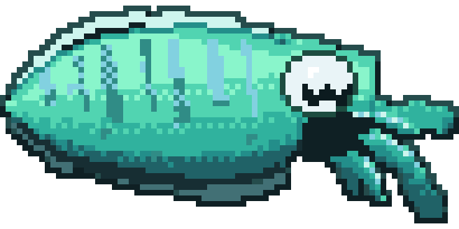
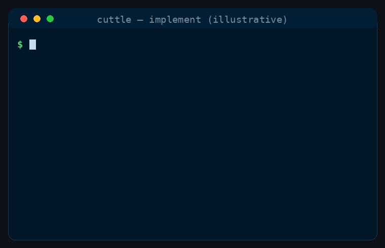

# Cuttle

<p align="center">
  
</p>

<p align="center">
  <b>Coding agent harness: frontier plans, local implements. The router is code.</b><br/>
  Pin <b>brain</b> / <b>hands</b> / <b>escalate</b> in the orchestrator — so expensive models plan and <b>your</b> local (or cheap) models execute, gated by deterministic evals.
</p>

<p align="center">
  <i>Frontier mind. Local hands.</i> — tagline only; local-first by default.
</p>

[](LICENSE)
[](https://saman-mb.github.io/cuttle/)
[](#-modes)
[](#-how-it-works)
[](pyproject.toml)
[](#-status)
[](CONTRIBUTING.md)
[](https://github.com/saman-mb/cuttle/stargazers)
[](https://github.com/saman-mb/cuttle/commits/main)
[](https://github.com/saman-mb/cuttle/issues)

<p align="center">
  
</p>
<p align="center"><sub><i>Illustrative — phases of <code>cuttle implement</code>; metrics in real runs come from the ledger (not invented here).</i></sub></p>

**[Website →](https://saman-mb.github.io/cuttle/)** · **[How it works →](#-how-it-works)** · **[Install →](#-install)**

---

## Why Cuttle

Claude Code, Codex, and friends are excellent agents. They are weak at **enforced hybrid economics**: “plan expensive, execute local.” Skills and config *ask* the model to delegate; the orchestrator LLM still decides whether to comply.

Cuttle inverts that:

| Concern | Who owns it |
|---|---|
| Which model is brain vs hands | **Orchestrator** (config) — never the LLM |
| What “done” means for a step | **Deterministic evals** (commands, files, content) |
| When to spend frontier again | **Escalate policy** after failed local/cheap hands |

Not another “supports Ollama” checkbox. A **control plane** for local-first coding agents.

---

## How it works

```text
cuttle implement "fix failing auth test"
        │
        ▼
   Brain (pinned) ──► Directive (linted, checkable steps)
        │
        ▼
   Hands (local by default) × N scoped steps
        │
        ▼
   Evals ──► retry / replan / escalate (only if you configured it) / done
        │
        ▼
   Receipt: brain $ · hands $ · escalate $ · what left the machine
```

- **Brain** plans only (read/search) and emits a structured directive.
- **Hands** execute one step at a time under path scope, with a fresh attempt packet on retry.
- **Evals** are code, not vibes — no LLM-as-judge gate.
- **Status spine** (CLI now; Rust TUI later): model · locality · cost · phase.

---

## Modes

| Mode | Brain | Hands | Cloud escalate |
|---|---|---|---|
| **`local`** (default intent) | Local / cheap | Local | Off unless you opt in |
| **`hybrid`** | Frontier | Local | Optional mid-tier after failed evals |
| **`cloud`** | Frontier | Cloud / cheap cloud | Per policy |

Escalate-to-cloud is a **configured door**, not a silent surprise.

---

## What leaves the machine

Be honest about hybrid:

- **Local mode:** plan + implement stay on your endpoint (e.g. Ollama). Nothing need phone home.
- **Hybrid:** the **brain** may send repo context / snippets to a frontier provider. Hands stay local by default.
- Every run should print a **privacy receipt** (what class of data left the box) once that surface ships — until then, assume hybrid brain traffic is sensitive.

---

## Install

Pre-alpha scaffold — APIs will move. Python **3.12+**.

```bash
git clone https://github.com/saman-mb/cuttle.git
cd cuttle
python3.12 -m venv .venv
source .venv/bin/activate
pip install -e ".[dev]"

cuttle version
```

### BYO Ollama quickstart (target path)

Point hands at a model you already run — no download theatre inside `implement`:

```bash
# example — exact flags land with the runtime epics
export CUTTLE_HANDS_MODEL=ollama:qwen2.5-coder:32b
export CUTTLE_HANDS_BASE_URL=http://127.0.0.1:11434
# optional hybrid brain:
# export CUTTLE_BRAIN_MODEL=anthropic:claude-sonnet-4-6

cuttle doctor          # tool-call smoke (when shipped)
cuttle implement "fix the failing test"
```

Copy [`.env.example`](.env.example) for more knobs. Optional `cuttle hands setup` (llmfit-class wizard) is **out of band** — never a side effect of `implement`.

---

## Status

**Pre-alpha.** Contracts and docs are ahead of the runtime. The kill criterion for marketing “local hands” is a **published golden suite** (pass@1, escalate %, $ vs all-frontier) — see the backlog.

Roadmap epics: [E1–E9 on GitHub](https://github.com/saman-mb/cuttle/issues?q=is%3Aissue+is%3Aopen+label%3Aepic).

---

## Stack (target)

- **Python 3.12+** engine — phase machine, `CuttleAgentRuntime`, evals, thin provider access
- **Rust** interactive TUI later — status spine + connect/models overlays; no orchestration in Rust
- Versioned engine event stream shared by CLI and TUI
- Typer / `--plain` / `NO_COLOR` always available

---

## Layout

| Path | Role |
|---|---|
| `src/cuttle/` | Engine (CLI, orchestrator, contracts, agents, evals, backends, …) |
| `crates/cuttle-tui/` | Rust TUI (when landed) |
| `docs/` | HLA, architecture, viability, assets |
| `docs/assets/` | README / site demo GIFs |
| `AGENTS.md` | Instructions for every coding harness |

---

## Docs

- [HLA](docs/hla.md) — end-state architecture (being aligned to local-first vision)
- [Architecture](docs/architecture.md) — design rationale
- [Viability](docs/viability.md) — why a harness beats hope-based routing
- [Website](https://saman-mb.github.io/cuttle/) — landing (Pages epic)

---

## Contributing

PRs welcome — see [CONTRIBUTING.md](CONTRIBUTING.md).

---

## Agent instructions

| File | Role |
|---|---|
| [`AGENTS.md`](AGENTS.md) | Source of truth for Cursor, Codex, Copilot, OpenCode, … |
| `CLAUDE.md` | Symlink → `AGENTS.md` |

Edit **`AGENTS.md` only**.

---

## License

[MIT](LICENSE)
