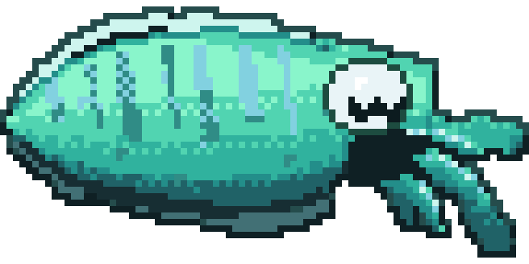
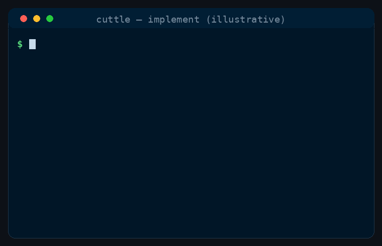

# Cuttle

<p align="center">
  
</p>

<p align="center">
  <b>A local-first coding agent that gives every piece of work to the right model.</b><br/>
  Pool of up to five models · Jev decides with calibrated probabilities · cheap steps stay cheap · private code stays local.
</p>

<p align="center">
  <i>Like a cuttlefish, it changes to suit the job.</i>
</p>

[](LICENSE)
[](https://saman-mb.github.io/cuttle/)
[](docs/brief.md)
[%20%2F%20Jev-134e4a)](docs/brief.md)
[](pyproject.toml)
[](#-status)
[](CONTRIBUTING.md)
[](https://github.com/saman-mb/cuttle/stargazers)
[](https://github.com/saman-mb/cuttle/commits/main)
[](https://github.com/saman-mb/cuttle/issues)

<p align="center">
  
</p>
<p align="center"><sub><i>Illustrative — real metrics come from the routing ledger once the runtime ships.</i></sub></p>

**[Website →](https://saman-mb.github.io/cuttle/)** · **[Brief →](docs/brief.md)** · **[Install →](#-install)**

---

## Why Cuttle

Claude Code, Codex, OpenCode, and pi are excellent agents. They are weak at **per-step routing that is cheap, measured, and enforced**: the expensive model often still decides who does what, privacy is a prompt, and you cannot prove you beat “frontier for everything” on cost.

Cuttle inverts that:

| Concern | Who owns it |
|---|---|
| Which model runs this step | **`decide()` + router** (Jev probabilities × preset) — not the coding LLM |
| What “done” means | **Verifier** (tests, lint, types) + optional `decide(done?)` |
| Privacy | **Router filter** — local-only paths never go to cloud |
| Did routing help? | **Evals + routing ledger** vs single-model baselines |

---

## How it works

```text
cuttle run "Add rate limiting and tests"
        │
        ▼
   decide: plan? · classify steps (C0–C4 + kind)
        │
        ▼
   For each step: P(success|model) → cheapest eligible above threshold
        │
        ▼
   Coding model + tools  →  verifier  →  retry / escalate / ask
        │
        ▼
   One diff · cost by model · /why · ledger write
```

- **Pool ≤ 5** coding models (cloud, local, or mixed). Decision and embedding models sit outside the five.
- **Presets:** Thrifty · Balanced · Best quality · Local only.
- **Cascade:** start cheap; escalate when checks fail.
- **Interfaces:** Textual TUI, headless/CI, editors via ACP.

---

## Modes (pool composition)

| Pool | Example |
|---|---|
| **Cloud only** | Frontier + mid-tier + cheap fast + open-weight via OpenRouter — no GPU needed |
| **Mixed** | Frontier + mid-tier cloud; local coder for easy/private work |
| **Local only** | Up to five local models — offline, free per task, slower |

---

## Install

Pre-alpha scaffold — APIs will move. Python **3.12+**.

```bash
git clone https://github.com/saman-mb/cuttle.git
cd cuttle
python3.12 -m venv .venv
source .venv/bin/activate
pip install -e ".[dev]"

cuttle version
```

Target happy path (when phases land):

```bash
cuttle init          # connect providers, optional local detect, pick ≤5, calibrate
cuttle run "fix the failing test"
```

Copy [`.env.example`](.env.example) for keys and pool overrides as they land.

---

## Status

**Pre-alpha.** The [project brief](docs/brief.md) is the product authority. Runtime follows phases **01–10** (pool/`decide()` → single-model loop → evals → routing → sub-agents → safety → learning → interfaces → packaging).

Roadmap: [phase epics on GitHub](https://github.com/saman-mb/cuttle/issues?q=is%3Aissue+is%3Aopen+label%3Aepic).

---

## Stack (target)

- **Python 3.12+** — LangGraph agent core, LiteLLM router, Textual TUI, evals
- **`decide()`** — hosted Jev or local Jev-style (Winnow / mini-jev)
- **Local models** — llama-swap → llama.cpp (or MLX on Mac); Ollama as a simpler option
- **Editors** — Agent Client Protocol; **MCP** client for tools

---

## Layout

| Path | Role |
|---|---|
| `src/cuttle/` | Product code (CLI, TUI, agent, decide, router, tools, evals, …) |
| `docs/brief.md` | Authoritative product brief |
| `docs/hla.md` | End-state architecture |
| `docs/assets/` | README / site GIFs |
| `AGENTS.md` | Instructions for every coding harness |

---

## Docs

- [Brief](docs/brief.md) — product, phases, Jev, stack
- [HLA](docs/hla.md) — engineering architecture
- [Architecture](docs/architecture.md) — design rationale
- [Viability](docs/viability.md) — why a harness vs configuring peers
- [Website](https://saman-mb.github.io/cuttle/) — landing

---

## Contributing

PRs welcome — see [CONTRIBUTING.md](CONTRIBUTING.md).

---

## Agent instructions

| File | Role |
|---|---|
| [`AGENTS.md`](AGENTS.md) | Source of truth for Cursor, Codex, Copilot, OpenCode, … |
| `CLAUDE.md` | Symlink → `AGENTS.md` |

Edit **`AGENTS.md` only**.

---

## License

[MIT](LICENSE)
