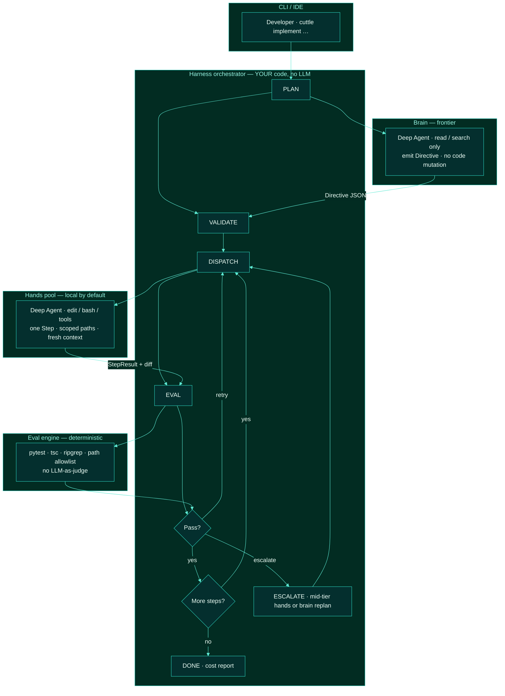
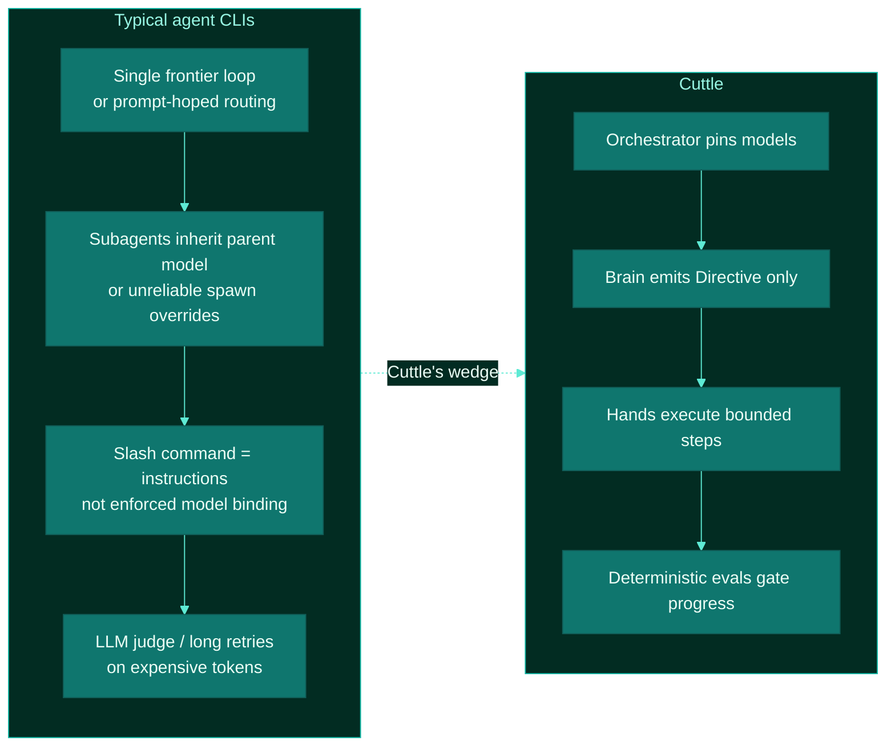

# Cuttle architecture

**Frontier mind. Local hands.**

Cuttle is a coding-agent harness that treats model routing as infrastructure, not a prompt hope. A frontier model plans. A local (or cheap) model executes. A deterministic orchestrator decides what runs, when it advances, and when to escalate.

This document is the scaffold-era design. Implementation comes next; the contracts and control plane below are the product.

---

## Thesis

Most agent CLIs today burn frontier tokens on mechanical turns (reads, edits, tool JSON, retries). Claude Code and Codex can attach cheaper models to named agents or custom configs, but **freeform “spawn a cheap subagent” is unreliable** — especially from slash commands / skills that only *ask* the orchestrator LLM to comply.

Cuttle inverts that:

| Concern | Who owns it |
|---|---|
| Which model runs which role | **Orchestrator** (config), never the brain LLM |
| What “done” means for a step | **Directive acceptance checks** + eval engine |
| When to spend frontier again | **Escalation rules** after failed local/cheap hands |

The economic bet: ~70% of agent tokens are execution. Keep those off the frontier whenever a local coder can follow a tight brief.

---

## System overview



*Source: [`diagrams/cuttle-harness.mmd`](diagrams/cuttle-harness.mmd)*



---

## How a run works

```text
cuttle implement "add admin login UI (no auth backend)"

1. Orchestrator starts phase PLAN
2. Brain (frontier) inspects the repo — read/search only
3. Brain emits a Directive: ordered steps, allowed paths, exact commands, acceptance checks
4. Orchestrator validates the schema (and optionally HITL plan preview)
5. For each step:
     Hands (local) executes exactly that step
     Eval engine runs acceptance checks
     fail → retry hands (fresh session)
     fail again → escalate that step only (cheap cloud hands or brain replan)
6. Final checks → report (brain $ · hands $0 · escalate $)
```

### Directive (the handoff)

The brain does not leave a vibes plan. It emits a contract:

- `objective` — what success looks like  
- `steps[]` — small, unambiguous units of work  
  - `files_allowed` / `files_forbidden`  
  - `instructions` — ultra-prescriptive for weaker local models  
  - `commands[]` — preferred exact shell  
  - `acceptance[]` — checkable claims (file exists, command exit 0, content match)  
- `final_checks[]` — suite-level gates  
- `escalate_if[]` — when hands must stop and return to the brain  

Hands never see the full frontier transcript — only the current step plus orchestrator-injected snippets.

---

## Concurrency model

Local inference can multiplex a few sessions (shared weights, per-session KV), but coding agents are context-heavy. Product defaults:

| Mode | Parallelism | Default? |
|---|---|---|
| Serial implement | 1 writer | **Yes** |
| Scout pack | 2–3 read-only | Optional |
| Worktree swarm | N isolated writers | Later / strong GPU |

Parallel *writers* on one checkout collide. Parallel *readers* are useful. The orchestrator caps concurrency; it does not ask the brain how many children to spawn.

---

## Why this is different from what’s out there



*Source: [`diagrams/cuttle-vs-today.mmd`](diagrams/cuttle-vs-today.mmd)*



### Comparison table

| Capability | Claude Code / Codex (native) | Gateway / org-chart tools | **Cuttle** |
|---|---|---|---|
| Cheaper subagents | Possible via frontmatter / agent TOML; **ad-hoc spawn unreliable** | Routes among existing CLIs | **Pinned** brain vs hands by config |
| Local execution | BYOK / Ollama possible, not the core loop | Often wraps cloud CLIs | **Default hands = local** |
| Plan → execute contract | Freeform | Engine-dependent | **Directive schema** |
| Advance criteria | Model decides | Model / engine decides | **Eval gates** |
| Escalation | Manual / hope | Per-employee config | **Step-scoped ladder** (local → mid-tier → replan) |
| What we build | Use as-is | Bus over engines | **Own harness + Deep Agents roles** |

Cuttle is not “another multi-agent swarm.” It is a **cost and reliability control plane** for hybrid cloud+local coding agents.

---

## Repository map (scaffold)

```text
cuttle/
  cli/              # cuttle entrypoint (future)
  orchestrator/     # LangGraph phase machine
  contracts/        # Directive / Step / Acceptance schemas
  agents/           # brain.py · hands.py (Deep Agents wrappers)
  middleware/       # scope guard · stuck detector · telemetry
  evals/            # deterministic checkers
  backends/         # model factories
  skills/           # optional workflows
  docs/
    architecture.md
    diagrams/
      cuttle-harness.svg
      cuttle-vs-today.svg
```

Deep Agents (or equivalent) are the **role runtimes**. Cuttle’s IP is the orchestrator, directive contract, evals, and escalation policy.

---

## Non-goals (v0)

- Trusting the brain LLM to pick cheaper children  
- LLM-as-primary-judge  
- Default 8-way local writer swarm on a single GPU  
- Replacing every existing coding CLI — Cuttle is the harness, not a Claude Code clone  

---

## Next implementation slice

1. Pydantic `Directive` / `Step` / `AcceptanceCheck`  
2. Brain agent: frontier, read-only, structured directive out  
3. Hands agent: local model, one step in / result out  
4. Orchestrator graph + pytest-backed eval runner  
5. CLI: `cuttle implement` + plan preview + cost summary  
