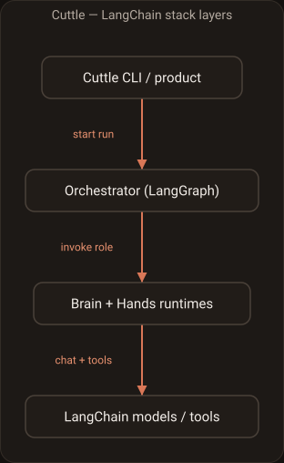
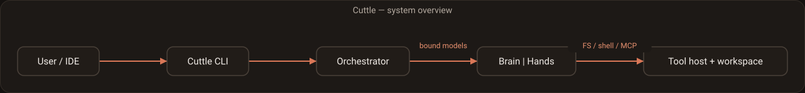
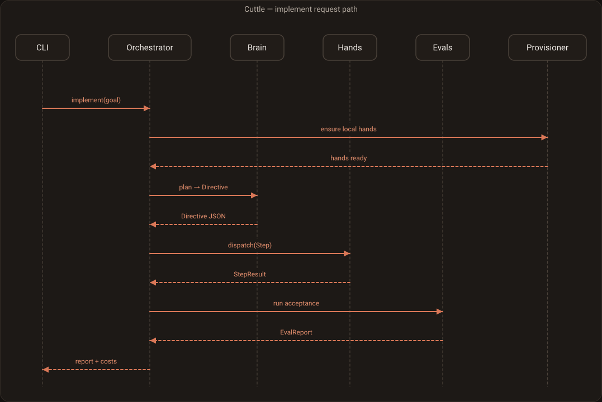
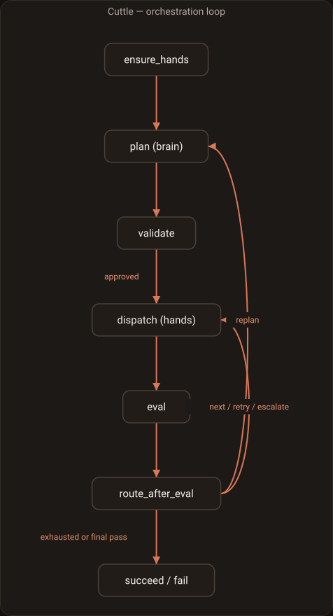

# Cuttle — high-level architecture (end state)

**Audience:** anyone building Cuttle.  
**Purpose:** target architecture, how the orchestration loop works, how it plugs into the LangGraph / LangChain stack, and what we have to implement.

**Tagline:** Frontier mind. Local hands.

---

## 1. Agent runtime: own it from day one

| | Role |
|---|---|
| **Target** | Cuttle-owned CLI, orchestrator, contracts/evals, local provisioner, **and** the brain/hands agent tool loop |
| **Not used** | Deep Agents (or any third-party harness) as the role runtime |

We build the inner “LLM + tools until done” loop ourselves on LangChain `create_agent` and/or a hand-rolled LangGraph model↔tools graph. That keeps harness behaviour, prompt weight, and upgrades under Cuttle’s control — required for peer-class DevEx and for local-hands fit.

**Hard rule:** no `task` / subagent tool as system router. Cuttle’s orchestrator decides phases and models.

---

## 2. How the LangChain stack fits (mental model)

Think in four layers. Cuttle uses more than one of them.



*Spec: [`diagrams/cuttle-stack.json`](diagrams/cuttle-stack.json) · rendered with Shipmates `diagram`*

| Piece | Library | Who owns behaviour |
|---|---|---|
| Outer run loop (plan/eval/escalate) | **LangGraph** `StateGraph` | **Cuttle** |
| Inner “LLM + tools until done” loop | **Cuttle** `AgentRuntime` (`create_agent` / tool loop) | Cuttle |
| Model client | LangChain chat models | Config / adapters |
| Persistence of orchestrator run | LangGraph checkpointer | Cuttle |
| Persistence of a single agent turn thread | Agent checkpointer (optional) | Runtime adapter |

So: **two graphs**, not one — and **two processes** at the product edge:

1. **Orchestrator graph** — Cuttle, phase machine, no freeform agenting (Python / LangGraph).  
2. **Role agent graphs** — brain or hands, classic tool-calling agent, one role per invoke (Python).  
3. **Interactive TUI** — Rust binary; render-only over a versioned event stream from the Python engine.

```text
cuttle (Rust TUI)  ←── versioned events (NDJSON / JSON-RPC) ──→  cuttle engine (Python)
   keys, layout, chromatophore pulse                              LangGraph + runtime + evals + provisioner
```

Official LangGraph supports **Python** and **JS/TS** only. Cuttle uses **Python** for the engine. Do not reimplement LangGraph in Rust.

---

## 3. End-state system diagram



*Spec: [`diagrams/cuttle-system-overview.json`](diagrams/cuttle-system-overview.json)*

Request path across those pieces:



*Spec: [`diagrams/cuttle-implement-sequence.json`](diagrams/cuttle-implement-sequence.json)*

Provisioner sits beside the orchestrator (called from `ensure_hands`), not inside the LangChain tool loop.

---

## 4. Orchestration loop (detailed)

### 4.1 What the loop is responsible for

The orchestrator is normal code shaped as a LangGraph. It:

- Picks **which model** runs (brain / hands / escalate-hands) from config  
- Calls brain **once** (or again on replan) to get a `Directive`  
- Walks `directive.steps` in order (default)  
- For each step: run hands → run evals → retry / escalate / advance  
- Stops on success, budget exhaustion, or unrecoverable failure  

It does **not** ask an LLM “what should we do next?” for phase transitions.

### 4.2 Orchestrator state (what we implement)

Conceptual `TypedDict` / pydantic state for the outer LangGraph:

```text
OrchestratorState
  run_id: str
  goal: str                          # user request
  workspace_root: str

  # model refs resolved from config at start
  brain_model: ModelRef
  hands_model: ModelRef
  escalate_hands_model: ModelRef

  directive: Directive | None
  step_index: int
  step_attempt: int                  # retries for current step
  step_tier: "local" | "escalate"    # which hands model this attempt

  last_step_result: StepResult | None
  last_eval: EvalReport | None

  status: "running" | "awaiting_approval" | "succeeded" | "failed" | "cancelled"
  # Phase/display lexicon also uses: idle | plan | hands | eval | escalate
  # cancelled = user Reject (HITL); failed = system/budget/eval exhaustion — both non-resumable

  failure_reason: str | None

  usage: list[UsageEvent]            # per-role tokens / $ / latency
  max_step_retries: int
  max_replans: int
  replan_count: int
```

Contracts (`Directive`, `Step`, `StepResult`, `EvalReport`, `ModelRef`, `UsageEvent`) are Cuttle packages under `contracts/`.

### 4.3 Nodes and edges



*Spec: [`diagrams/cuttle-orchestrator-loop.json`](diagrams/cuttle-orchestrator-loop.json)*

Side arrows from `route_after_eval`: **next / retry / escalate** → `dispatch`; **replan** → `plan`; **exhausted or final pass** → `succeed / fail`. Optional HITL approval sits between `validate` and `dispatch` (not drawn; interrupt in LangGraph).

| Node | LLM? | What it does |
|---|---|---|
| `ensure_hands` | No | If local hands missing/unhealthy → provisioner (or fail with setup instructions) |
| `plan` | **Yes — brain** | Invoke brain runtime with goal + repo context budget; parse `Directive` |
| `validate` | No | Schema validate; path sanity; reject empty/unsafe directives |
| `approve` | No (HITL) | Optional interrupt for user to accept/edit plan |
| `dispatch` | **Yes — hands** | Build step prompt from `Step`; invoke hands with scoped tools; collect `StepResult` |
| `eval` | No | Run acceptance checks for this step; produce `EvalReport` |
| `route_after_eval` | No | Pure branching on eval + counters (retries, tier, replans) |
| `final_eval` | No | Run `directive.final_checks` |
| `succeed` / `fail` | No | Persist run, emit cost report |

### 4.4 Step lifecycle (one step)

```text
dispatch(step_index, tier=local)
  → hands.run(Step, model=hands_model)
  → eval(step.acceptance)
       pass → step_index += 1; step_attempt = 0; tier = local
       fail → step_attempt += 1
            if step_attempt <= max_step_retries:
                 dispatch again (fresh hands thread)
            else if tier == local and escalate configured:
                 tier = escalate; step_attempt = 0; dispatch
            else if replan_count < max_replans:
                 replan_count += 1; go to plan with failure packet
            else:
                 fail run
```

**Fresh hands thread per attempt** matters: local models context-rot; don’t keep appending forever.

### 4.5 What brain receives / returns

**Input (orchestrator → brain):**

- User goal  
- Optional: file tree summary, failing tests, previous failure packet  
- System rules: emit only `Directive`; do not edit files  

**Output:** structured `Directive` (via `response_format` / structured output).

Brain tools (allowed): read-only FS, grep/glob, maybe read-only shell.  
Brain tools (denied): write/edit/mutating execute.

### 4.6 What hands receive / returns

**Input (orchestrator → hands):**

- Single `Step` (goal, instructions, allowed paths, commands, acceptance text)  
- Injected snippets orchestrator chose (not full brain chat)  
- System rules: only touch `files_allowed`; stop when step goal met  

**Output:** `StepResult` (summary, files touched, commands run, raw errors).

Hands tools: full coding toolset, optionally filtered by path middleware.

### 4.7 Failure packet (for replan)

When escalating back to brain:

```text
FailurePacket
  goal
  directive_id / version
  failed_step: Step
  attempts: [StepResult + EvalReport, ...]
  git_diff_stat or file list
  escalate_if matches (if any)
```

Brain’s job on replan: revise remaining steps (or whole directive), not chat vaguely.

---

## 5. LangGraph / LangChain integration points

This section is the “what do we call in the stack?” map.

### 5.1 Orchestrator graph (Cuttle)

**Implement with:** `langgraph.graph.StateGraph`

| Integration | API / concept | Cuttle use |
|---|---|---|
| Define state | `TypedDict` + reducers | `OrchestratorState` |
| Add nodes | `builder.add_node(name, fn)` | plan, validate, dispatch, eval, … |
| Conditional edges | `add_conditional_edges` | `route_after_eval` |
| Compile | `builder.compile(checkpointer=...)` | resume runs, HITL |
| Invoke | `graph.ainvoke(input, config={"configurable": {"thread_id": run_id}})` | CLI entry |
| Interrupt / HITL | `interrupt()` or interrupt-before node | plan approval |
| Streaming | `astream_events` / `astream` | CLI live UI |

**We write:** all node functions, routing functions, state schema, compile wiring.

**We do not use:** a single `create_deep_agent` as the outer graph.

### 5.2 Provider hub + model binding

Operator UX (OpenCode-class): **connect many vendors → auth once → models become available → assign to roles.** The orchestrator still owns binding at run time; agents never pick providers mid-run.

```text
cuttle auth login /connect  →  credential store (~/.config/cuttle/auth.json)
cuttle models               →  catalog of models you can use right now
assign to role              →  brain | hands | escalate  (ModelRef in config)
factory                     →  BaseChatModel (LangChain)
```

#### Layers (modular — add a vendor without touching LangGraph)

| Layer | Owns | Does not own |
|---|---|---|
| **Provider registry** | Vendor id, display name, auth kind (api_key / oauth / env / none), adapter kind, default base URL, catalog source | Orchestrator phases |
| **Auth store** | Credentials only (`cuttle auth login \| list \| logout`); never committed | Model quality knobs |
| **Catalog** | Models available after auth (+ optional live `/v1/models`); whitelist/blacklist | Role pinning |
| **Capability profiles** | Which knobs each provider/model family supports | Secrets |
| **Factory (`backends/`)** | `ModelRef` → `BaseChatModel` | UI chrome |

**Adapters (not per-vendor if/else in the orchestrator):**

| Adapter kind | Use for |
|---|---|
| `native` | First-class LangChain integrations (Anthropic, OpenAI, Google, …) where quality knobs matter |
| `openai_compat` | Long-tail cloud + local gateways (OpenRouter-style, Ollama, llama.cpp, LM Studio, custom `/v1`) |
| `bedrock` / `azure` / … | Thin dedicated adapters when OpenAI-compat is insufficient |

**Day-one vendor bar:** Anthropic + OpenAI native; OpenAI-compatible catch-all (“Other”); local Ollama/compat for hands. Expand the registry with catalog rows + adapter mapping — do not hardcode 75 vendors into the phase graph.

**Secrets vs config:** project/user config stores `ModelRef`s and role preferences only. API keys live in the auth store or env (`CUTTLE_*` / provider env). Never require keys in committed files.

#### Model binding (LangChain)

**Implement with:** `langchain.chat_models.init_chat_model` and/or explicit clients, plus provider-specific kwargs where needed.

| Role | Typical binding |
|---|---|
| Brain | Catalog pick → `init_chat_model("anthropic:…")` / OpenAI / etc. |
| Hands local | `ChatOllama` / OpenAI-compatible → local base URL (or provisioner-registered ref) |
| Hands escalate | Cheaper cloud model from the same catalog |

Orchestrator resolves `ModelRef` → `BaseChatModel` **before** invoke and passes the instance into the runtime. The role agent must not pick another model mid-run. Session `/models` (E5) only changes **role slots** between runs or at approved config points — never mid-step hands dispatch.

#### `ModelRef` and generation / reasoning controls

`ModelRef` is more than a model id. It carries **optional, capability-gated** controls so operators can tune brain (and escalate) quality without hard-coding one provider’s API:

| Control (config name) | Intent | Applied when |
|---|---|---|
| `context` / `max_input_tokens` | Context window / depth budget for the role | Provider exposes context or we cap via truncation policy |
| `effort` | Reasoning / compute effort (e.g. OpenAI-style effort levels) | Capability profile says `effort` supported |
| `thinking` / `thinking_budget` | Extended thinking / reasoning tokens (e.g. Anthropic thinking) | Capability profile says `thinking` supported |
| `temperature`, `top_p`, `max_output_tokens` | Standard sampling caps | Nearly universal; still validated against profile |
| `extra` | Escaped provider kwargs (last resort) | Explicit allowlist / documented only — not a free-for-all dump |

**Compatibility rules (hard):**

1. **Capability profile per provider/model family** (Cuttle-owned table or detector): which knobs exist and how they map to LangChain/client kwargs.  
2. **Unsupported knobs fail closed at config load or resolve** with British-English copy naming the model and the unsupported field — never silently ignore brain `effort`/`thinking` the user thought was on.  
3. **Hands local defaults stay thin** — these knobs are first-class for **brain** (and escalate when useful); local hands may ignore or subset them when the local server cannot honour them (documented per backend).  
4. Factory maps supported knobs → `BaseChatModel` bind/`model_kwargs` / provider APIs; orchestrator still injects the resulting instance unchanged.

Brain config example (illustrative):

```text
brain:
  model: anthropic:claude-opus-4-6
  context: 200000          # or max_input_tokens
  thinking: true
  thinking_budget: 10000   # if profile supports budgets
  # effort: high           # only if that provider profile supports effort
```

Custom OpenAI-compatible provider (illustrative):

```text
providers:
  my-gateway:
    adapter: openai_compat
    name: My Gateway
    base_url: https://api.example.com/v1
    # api key via: cuttle auth login my-gateway
    models:
      coder-large: { name: Coder Large }
```

### 5.3 Brain / hands runtime interface

Stable interface so the orchestrator never depends on tool-loop internals:

```text
class AgentRuntime(Protocol):
  def run(
    self,
    *,
    role: Literal["brain", "hands"],
    model: BaseChatModel,
    system_prompt: str,
    user_payload: dict | str,    # goal or Step JSON
    tools: Sequence[BaseTool] | None,
    response_schema: type | None,  # Directive or StepResult
    thread_id: str,
    workspace: WorkspaceRef,
  ) -> AgentRunResult: ...
```

| Implementation | When | Implements `run` via |
|---|---|---|
| `FakeAgentRuntime` | E1 tests / CLI stub | Fixtures only |
| `CuttleAgentRuntime` | Day one (product) | LangChain `create_agent` and/or hand-rolled LangGraph model↔tools loop + Cuttle tool host |

Orchestrator only depends on `AgentRuntime`. There is no Deep Agents adapter and no “replace later” runtime epic.

### 5.4 CuttleAgentRuntime wiring (concrete)

Each role is a **separate** agent graph (or one factory with different kwargs). Orchestrator invokes them like subprocesses (in-process graphs).

**Brain**

| Concern | Setting |
|---|---|
| `model` | frontier `BaseChatModel` (orchestrator-injected) |
| `system_prompt` | plan-only instructions (thin; no rented harness base prompt) |
| structured output | `Directive` schema |
| tools | read/search only (Cuttle tool host allowlist) |
| middleware | deny write/edit/mutating execute |
| subagents / `task` | **absent** — not part of the runtime |
| workspace | repo-rooted backend |
| checkpointer | optional ephemeral per plan call |

**Hands**

| Concern | Setting |
|---|---|
| `model` | local or escalate `BaseChatModel` (orchestrator-injected) |
| `system_prompt` | execute-this-step instructions (sized for local models) |
| structured output | `StepResult` (or parse final message) |
| tools | coding tools from Cuttle tool host as needed |
| middleware | path scope guard, stuck detector; optional interrupt on destructive tools |
| subagents / `task` | **absent** |
| workspace | same workspace (or worktree) |
| thread | **fresh** `thread_id` per attempt |

**Implementer rules:**

- Pass an explicit `model=` every time; never rely on library defaults.  
- Prefer structured output for `Directive` so orchestrator doesn’t regex JSON out of prose.  
- Own FS / edit / shell tools under the tool host — peer-class reliability is a first-party bar, not a dependency hope.  
- Keep prompts thin enough for local 14–32B hands; do not inherit a cloud-agent “fat harness” prompt stack.

### 5.5 Inner agent loop shape

```text
agent_loop (LangGraph / create_agent)
  node: model (BaseChatModel.bind_tools)
  node: tools (ToolNode / Cuttle tool host)
  edges: model → tools → model until no tool calls / structured end
  middleware: summarization (when we choose), scope guard, stuck detector
```

Filesystem/shell live as LangChain tools we own under `backends/` / tool host.

### 5.6 Tools and MCP

| Concern | Stack piece | Cuttle work |
|---|---|---|
| Define tools | `langchain.tools.BaseTool` / `@tool` | Tool host package |
| MCP tools | LangChain MCP adapters / client | Load from user config; attach to hands (and limited to brain) |
| Sandbox execute | backend protocol / our executor | Provisioner + security policy |

Orchestrator chooses **tool allowlists per role** when calling `AgentRuntime.run`.

### 5.7 Persistence

| What | Mechanism |
|---|---|
| Whole Cuttle run (step index, directive, usage) | Orchestrator LangGraph checkpointer (`thread_id=run_id`) |
| Single hands attempt transcript | Optional separate thread_id; discard after eval |
| Cross-session memory (later) | Store / memory files — product feature, not required for MVP loop |

### 5.8 Provisioner (mostly outside LangChain)

| Step | Integration |
|---|---|
| Recommend | shell out / library call to **llmfit** JSON |
| Download | Hugging Face Hub API / `huggingface_hub`, or Ollama pull |
| Deploy | start/ensure Ollama|llama.cpp|MLX server; wait for `/health` |
| Register | write `ModelRef` into Cuttle config |
| Use | `init_chat_model` / OpenAI-compat base URL pointing at that server |

LangChain only sees a normal chat model endpoint after provisioner finishes.

### 5.9 Observability (optional but planned)

- LangSmith tracing on brain/hands runs (`langchain` env vars / callbacks)  
- Cuttle-native usage events in orchestrator state for the user-facing cost report  

---

## 6. What needs to be implemented (checklist)

Ordered roughly by dependency. Packages map to repo folders.

### A. Contracts (`src/cuttle/contracts/`) — no LLM required

- [ ] `ModelRef` (id, endpoint, role extras + capability-gated controls: context, effort, thinking, sampling)  
- [ ] `Directive`, `Step`, `AcceptanceCheck`  
- [ ] `StepResult`, `EvalReport`, `FailurePacket`  
- [ ] `UsageEvent`, run status enums (`idle|plan|hands|eval|escalate|awaiting_approval|succeeded|failed|cancelled`)  
- [ ] JSON Schema / pydantic validation helpers  

### B. Provider hub + model factory (`src/cuttle/backends/`, `providers/`, `auth/`, config)

- [ ] Provider registry entries (id, auth kind, adapter kind, base URL, catalog source)  
- [ ] Auth store + `cuttle auth login | list | logout` (credentials out of repo config)  
- [ ] Catalog: models available after auth (+ optional live list); whitelist/blacklist  
- [ ] Custom OpenAI-compatible provider (“Other”) via config block  
- [ ] Load user/project config (role `ModelRef`s only — no secrets)  
- [ ] Resolve env overrides  
- [ ] Capability profiles (which knobs each provider/model family supports) — **one** checked-in matrix  
- [ ] Factory: `ModelRef` → `BaseChatModel` (native + openai_compat + local), mapping supported knobs only  
- [ ] Fail closed on unsupported brain controls (no silent drop)  
- [ ] Defaults for brain / hands / escalate; `cuttle models` lists assignable refs  

### C. Eval engine (`src/cuttle/evals/`)

- [ ] Command runner (timeout, cwd, capture)  
- [ ] File exists / content match / regex  
- [ ] Path allowlist diff check (git or walk)  
- [ ] Aggregate `EvalReport`  

### D. Orchestrator (`src/cuttle/orchestrator/`) — LangGraph

- [ ] `OrchestratorState`  
- [ ] Nodes: ensure_hands, plan, validate, approve, dispatch, eval, route, final_eval, succeed/fail  
- [ ] Conditional edges for retry/escalate/replan  
- [ ] Checkpointer + `thread_id`  
- [ ] Usage aggregation + final report object  

### E. Agent runtime (`src/cuttle/agents/`)

- [ ] `AgentRuntime` protocol  
- [ ] `CuttleAgentRuntime` (day one)  
  - [ ] Brain factory (read-only tool allowlist, structured `Directive`, no subagents/`task`)  
  - [ ] Hands factory (scoped tools, fresh thread per attempt, no subagents/`task`)  
- [ ] Cuttle tool host: FS / edit / shell (peer-class reliability bar)  
- [ ] Prompt builders: goal→brain message; Step→hands message (thin for local models)  

### F. Middleware / tool host (`src/cuttle/middleware/`, tool host)

- [ ] Path scope guard for hands  
- [ ] Deny mutate tools for brain  
- [ ] Stuck detector (repeat tool loop)  
- [ ] Workspace backend wiring  
- [ ] Streaming + usage event hooks suitable for CLI/TUI  

### G. Local provisioner (`src/cuttle/provisioner/`)

- [ ] Hardware detect  
- [ ] llmfit recommend integration  
- [ ] Download + deploy + health check  
- [ ] `cuttle hands install` / `cuttle setup` flows  

### H. CLI / engine surface (`src/cuttle/cli/`)

- [ ] Thin Python entry: `cuttle implement`, `doctor`, `auth`, `models`, plain/`--plain` text UI  
- [ ] Versioned run-event stream (status lexicon, step progress, usage) for TUI consumers  
- [ ] Sessions / resume  
- [ ] Skills + slash commands (incl. `/connect`, `/models` mapping to real verbs)  
- [ ] Permissions UX  
- [ ] MCP config loading  

### I. Rust TUI (`crates/cuttle-tui/` or equivalent)

- [ ] Native interactive TUI crate (fast startup / rendering)  
- [ ] Spawns or attaches to Python engine; speaks the same event protocol as E2 text CLI  
- [ ] Render-only: no phase/routing/model decisions in Rust  
- [ ] `/connect` + `/models` UX calling Python auth/catalog verbs (role assign only)  
- [ ] Coastal chrome + simple chromatophore shape/pulse; `--plain` / `NO_COLOR` / reduced-motion  
- [ ] Must not load marketing mascot assets  

---

## 7. Same loop from day one

```text
Component              Day one / end state
──────────────────────────────────────────
Orchestrator loop      Cuttle LangGraph
Contracts / evals      Cuttle
Model factory          LangChain init_chat_model
Brain/hands invoke     CuttleAgentRuntime
Tools / FS / shell     Cuttle tool host
Provisioner            stub → full llmfit+HF path
CLI                    thin → full product surface
```

There is no “swap Deep Agents later” phase. Harness quality is raised inside `CuttleAgentRuntime` and the tool host.

---

## 8. Non-goals for the orchestrator

- Letting brain call hands via any `task` / subagent router  
- Depending on Deep Agents (or similar rented harnesses) for the role loop  
- LLM-as-judge as the primary step gate  
- One mega-agent graph that both plans and edits under a single model  
- Rebuilding provisioner inside LangChain (keep it a normal service module)  

---

## 9. Summary

| Question | Answer |
|---|---|
| Where is the Cuttle brain/hands logic enforced? | **Orchestrator LangGraph** (phases + model binding + evals) |
| Where does LangChain sit? | Chat models, tools, middleware, `create_agent` / tool loop |
| Where does Deep Agents sit? | **Nowhere** — not a dependency |
| What do we implement first? | Contracts → evals → orchestrator → CuttleAgentRuntime → thin CLI + event stream |
| Where does the interactive TUI live? | **Rust** crate — event consumer only; Python owns LangGraph |
| What is the bar for the harness? | Peer-class DevEx without cloning Claude Code’s full surface |

## Diagrams

Committed SVGs under [`diagrams/`](diagrams/), built with the Shipmates [`diagram`](https://github.com/saman-mb/shipmates) tool (JSON spec → SVG; not Mermaid).

| Diagram | Spec | SVG |
|---|---|---|
| Stack layers | [`cuttle-stack.json`](diagrams/cuttle-stack.json) | [`cuttle-stack.svg`](diagrams/cuttle-stack.svg) |
| System overview | [`cuttle-system-overview.json`](diagrams/cuttle-system-overview.json) | [`cuttle-system-overview.svg`](diagrams/cuttle-system-overview.svg) |
| Implement sequence | [`cuttle-implement-sequence.json`](diagrams/cuttle-implement-sequence.json) | [`cuttle-implement-sequence.svg`](diagrams/cuttle-implement-sequence.svg) |
| Orchestrator loop | [`cuttle-orchestrator-loop.json`](diagrams/cuttle-orchestrator-loop.json) | [`cuttle-orchestrator-loop.svg`](diagrams/cuttle-orchestrator-loop.svg) |

Re-render:

```bash
DIAG=~/.agents/skills/shipmates-diagram/diagram.py
OUT=docs/diagrams
python3 "$DIAG" --spec "$OUT/cuttle-stack.json" --out "$OUT/cuttle-stack.svg"
python3 "$DIAG" --spec "$OUT/cuttle-system-overview.json" --out "$OUT/cuttle-system-overview.svg"
python3 "$DIAG" --spec "$OUT/cuttle-implement-sequence.json" --out "$OUT/cuttle-implement-sequence.svg"
python3 "$DIAG" --spec "$OUT/cuttle-orchestrator-loop.json" --out "$OUT/cuttle-orchestrator-loop.svg"
```

Related: [architecture.md](architecture.md), [viability.md](viability.md).
